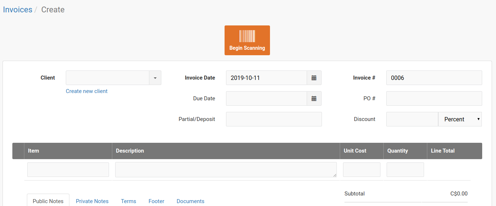
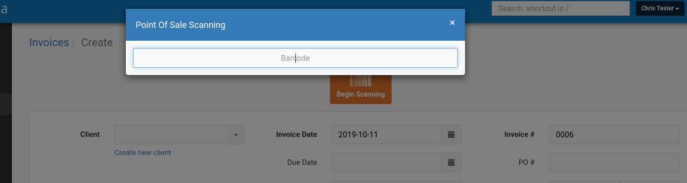

# Point Of Sale module for Invoice Ninja

This module adds the ability to use a barcode scanner to scan items into an invoice.

## Features
- Scanner dialog can be triggered manually using the button on the Invoices / Create or Invoices / Edit pages
- Automatically increments the quantity if the item already exists and the invoice line item has not been modified
- Does not interfere with traditional invoice item entry

## Installation
Install the module like any other Invoice Ninja module:

```
php artisan module:install dicarlosystems/pointofsale --type=github
```

After the installation is complete, you must run the Artisan command to inject the view into the relevant Invoice Ninja views:
```
php artisan pointofsale:inject-scanner
```

To remove the scanner from the page(s), run the following command:
```
php artisan pointofsale:eject-scanner
```

## Issues / Feedback
This module is very new and all feedback or issues are welcome!  Feel free to open an issue for any bugs or feature requests.

## Screenshots





